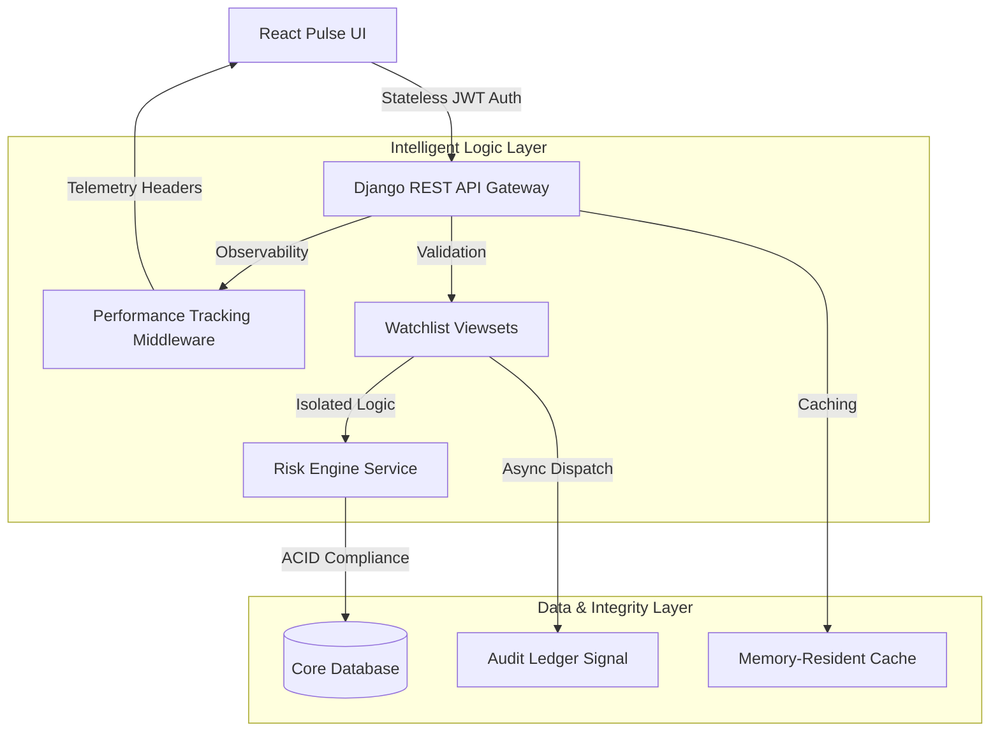

<div align="center">
  <h1>📈 Trading Pulse Engine</h1>
  <p><b>Advanced Risk Prioritization & Algorithmic Watchlist Architecture</b></p>
  
  <p><i>A production-grade backend system engineered for extreme performance, security, and market-ready data integrity.</i></p>

  [](#)
  [](#)
  [](#)
  [](#)
  [](#)
</div>

---

## 🎯 The Vision

In high-frequency trading, every millisecond counts. Simple CRUD applications fail to meet the "pulse" of the market. **Trading Pulse Engine** is built to bridge that gap—combining a stateless high-throughput API with an intelligent **Risk Engine** that provides real-time prioritization insights.

> [!TIP]
> **Key Differentiator**: This isn't a task list. It's a decoupled data pipeline using **Services** and **Event-Driven Signals** to ensure high-speed decision making.

---

## 🏗️ System Architecture



---

## 🔥 Elite Engineering Pillars

### 1. High-Precision Observability
Unlike standard APIs, every response from this engine includes an `X-Execution-Time` header. We utilize custom **Middleware** to intercept the request-response lifecycle, measuring execution latency to the microsecond.

### 2. Event-Driven Compliance (Audit Trails)
Using **Django Signals**, auditing is completely decoupled from the HTTP response. Every creation, update, or soft-deletion fires an asynchronous internal event, building an immutable background ledger (`WatchlistAuditLog`) without blocking the user.

### 3. "Bulletproof" Data Integrity
We don't trust application-layer validation alone. The schema implements **Database-Level CheckConstraints**, ensuring mathematical sanity (`price > 0`) even if the API is bypassed.

### 4. Zero-Downtime Microservices Design
We include a dedicated `/api/v1/health/` topology endpoint. It verifies the "Pulse" of the database and caching clusters individually, making it instantly ready for Kubernetes-led health monitoring.

---

## 🚀 API Documentation & UI

Access our interactive documentation to explore the engine's full capabilities:

- **Swagger UI**: [http://127.0.0.1:8000/swagger/](http://127.0.0.1:8000/swagger/)
- **ReDoc UI**: [http://127.0.0.1:8000/redoc/](http://127.0.0.1:8000/redoc/)

### Smart Payload Example
**`POST /api/v1/watchlist/`**
```json
{
  "symbol": "BTCUSDT",
  "target_price": "68500.00",
  "current_price": "67900.00"
}
```

**Intelligence Response** (`201 Created`):
```json
{
  "id": 42,
  "risk_analysis": {
    "risk_level": "HIGH",
    "risk_score": 0.0088,
    "insight": "High probability trigger; current price is within 2% of target."
  }
}
```

---

## 🛡️ Security Matrix

- **JWT Auth**: Rotating tokens with 15-minute TTL.
- **RBAC**: Multi-tenant isolation ensuring Users only access their own matrix.
- **Throttling**: Integrated `UserRateThrottle` to prevent algorithmic abuse.
- **CORS**: Strict Origin controls configured for production readiness.

---

## 💻 Local Setup & Execution

### 1. Initialize Operating Core
```bash
python -m venv venv
source venv/bin/activate  # Windows: .\venv\Scripts\activate
pip install -r requirements.txt
python manage.py makemigrations accounts watchlist
python manage.py migrate
```

### 2. Launch Engine & UI
```bash
# Terminal 1: Backend
python manage.py runserver

# Terminal 2: Frontend
cd frontend
npm install && npm run dev
```

### 3. Validation Suite
```bash
python manage.py test accounts watchlist
```

---

## 🔮 Future Scalability Path

- [ ] **WebSockets**: Transitioning the Risk Engine to `django-channels` for real-time tickers.
- [ ] **Celery Workers**: Moving audit log signal processing to Redis-backed worker queues.
- [ ] **Docker Swarm**: Production-ready container orchestration files.

---

<div align="center">
  <p><b>Designed & Engineered for Primetrade.ai</b></p>
  <p>Built with ❤️ by Manoj Kumar</p>
</div>
